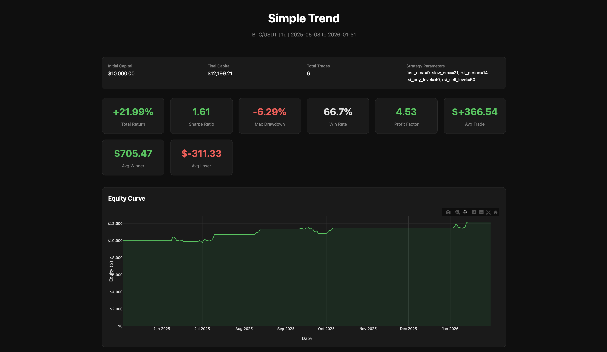
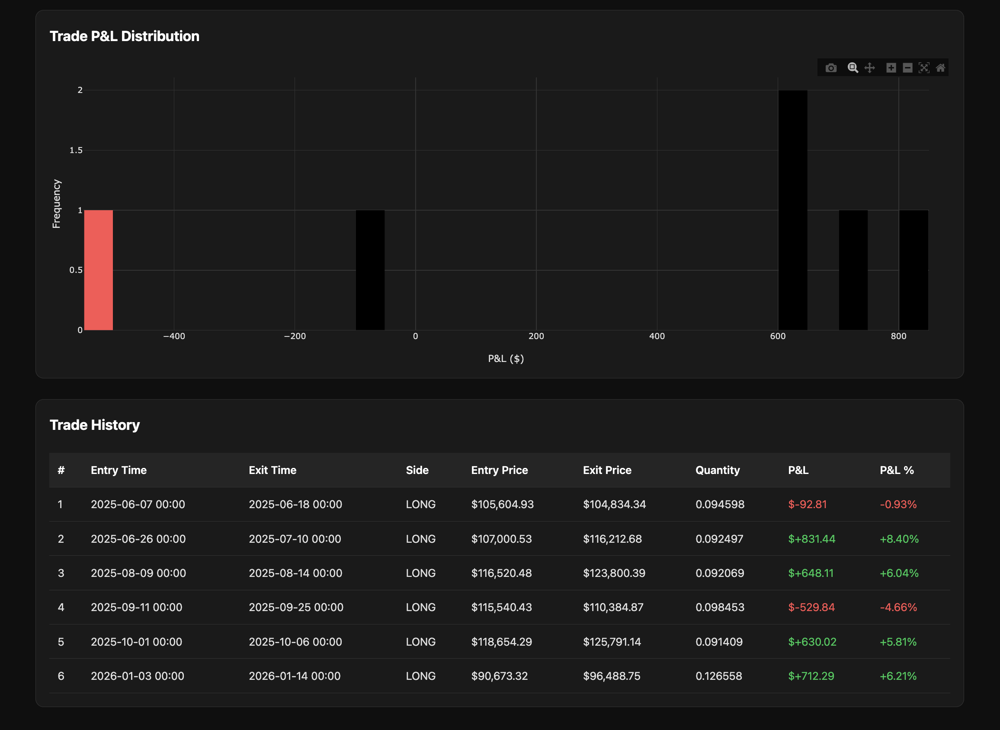
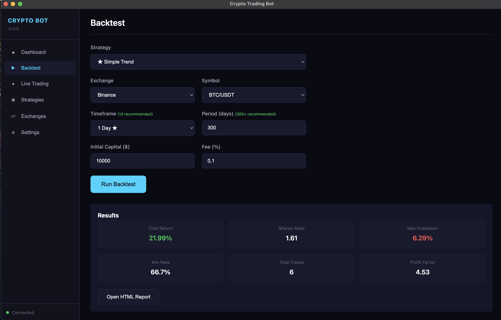

# 🪙📈 Crypto Trading Bot

A Python + Electron project I'm building with the help of AI to backtest and run algorithmic trading strategies on cryptocurrencies.


## What is it?

It's a trading bot with a modern GUI that:
- **Downloads historical market data** from major exchanges (Binance, Kraken, etc.)
- **Backtests trading strategies** to see if they would have made money
- **Runs live/paper trading** with real-time signals
- **Generates visual reports** with equity curves, drawdowns, and trade analysis

Currently includes **18 built-in strategies** ranging from simple (MA Crossover, RSI) to advanced (Regime Filter, Multi-Indicator Confirmation).

## Results (Screenshots)

### Backtest Report

The bot generates interactive HTML reports showing equity curves, drawdowns, and trade analysis.


*Equity curve, price chart with buy/sell signals, and drawdown analysis*

### Trade Distribution


*PnL distribution histogram and performance metrics*

*(Note: These are just simulations, not real money)*

### GUI Preview

Modern dark-themed interface built with Electron:


*Backtest configuration and results display*

## How I built it

| Component | Technology |
|-----------|------------|
| **Backend** | Python 3.11 |
| **GUI** | Electron + Vanilla JS |
| **API Server** | FastAPI |
| **Exchange Data** | ccxt library |
| **Technical Analysis** | ta library |
| **Charting** | Plotly |
| **AI Assistance** | Cursor |

## How to try it

### Prerequisites

- **Python 3.11+** - [Download](https://www.python.org/downloads/)
- **Node.js 18+** - [Download](https://nodejs.org/)
- **Git** - [Download](https://git-scm.com/)

---

### 🍎 macOS

```bash
# Clone the repo
git clone https://github.com/amaffiotto/crypto-trading-bot.git
cd crypto-trading-bot

# Create virtual environment
python3 -m venv venv
source venv/bin/activate

# Install dependencies
pip install -r requirements.txt
cd electron && npm install && cd ..

# Run the bot
python3 start.py
```

Or use the shell script:
```bash
chmod +x start.sh
./start.sh
```

---

### 🐧 Linux (Ubuntu/Debian)

```bash
# Install prerequisites (if needed)
sudo apt update
sudo apt install python3 python3-venv python3-pip nodejs npm git

# Clone the repo
git clone https://github.com/amaffiotto/crypto-trading-bot.git
cd crypto-trading-bot

# Create virtual environment
python3 -m venv venv
source venv/bin/activate

# Install dependencies
pip install -r requirements.txt
cd electron && npm install && cd ..

# Run the bot
python3 start.py
```

Or use the shell script:
```bash
chmod +x start.sh
./start.sh
```

---

### 🪟 Windows

**Option 1: Command Prompt / PowerShell**

```powershell
# Clone the repo
git clone https://github.com/amaffiotto/crypto-trading-bot.git
cd crypto-trading-bot

# Create virtual environment
python -m venv venv
venv\Scripts\activate

# Install dependencies
pip install -r requirements.txt
cd electron
npm install
cd ..

# Run the bot
python start.py
```

**Option 2: Double-click to run**

After installing dependencies, simply double-click `start.bat` to launch the bot.

---

### CLI Mode (All Platforms)

If you prefer a terminal-based interface:

```bash
# macOS/Linux
python3 -m src.main

# Windows
python -m src.main
```

Then select option 1 (CLI) when prompted.

## Deployment & Documentation

For detailed setup, configuration, and deployment instructions, see the **[guides](guides/)** folder:

- **[Getting Started](guides/01-GETTING-STARTED.md)** — Full installation for macOS, Linux, and Windows
- **[Configuration Reference](guides/02-CONFIGURATION.md)** — Every setting explained
- **[Docker Deployment](guides/03-DOCKER-DEPLOYMENT.md)** — Run with Docker and Docker Compose
- **[AWS](guides/04-AWS-DEPLOYMENT.md)** | **[GCP](guides/05-GCP-DEPLOYMENT.md)** | **[VPS](guides/06-VPS-DEPLOYMENT.md)** — Cloud and VPS deployment guides
- **[Strategy Development](guides/07-STRATEGY-GUIDE.md)** — Build custom strategies, filters, backtesting, and paper trading

## Project Structure

```
crypto-trading-bot/
├── src/
│   ├── strategies/      # 18 built-in trading strategies
│   │   └── filters/     # Signal filters (regime, multi-timeframe)
│   ├── backtesting/     # Backtest engine & reports
│   ├── trading/         # Live trading engine
│   ├── core/            # Exchange, data & database management
│   ├── notifications/   # Telegram, Discord, Email, WhatsApp
│   └── api/             # FastAPI server for GUI
├── electron/            # Electron GUI
├── config/              # Configuration files
├── data/                # SQLite database & OHLCV cache
└── reports/             # Generated backtest reports
```

## Available Strategies

| Category | Strategies |
|----------|------------|
| **Simple (Recommended)** | Simple Trend ⭐, Momentum RSI ⭐ |
| **Basic** | MA Crossover, RSI, MACD, Bollinger Bands |
| **Intermediate** | Trend Momentum, Mean Reversion, SuperTrend, Grid Trading, DCA, Triple EMA, Breakout |
| **Advanced** | ADX BB Trend, Donchian Breakout, Regime Filter, Multi Confirm, Volatility Breakout |

## Important Notes

⚠️ **This is for educational purposes only.** Past performance does not guarantee future results.

💡 **Tip:** Use **1 Day timeframe** with **300+ days** of data for best backtest results. Lower timeframes (1h, 4h) tend to generate too many false signals.

## New Features

### Multi-Channel Notifications

Get alerts via your preferred channels:

| Channel | Status | Notes |
|---------|--------|-------|
| Telegram | Ready | Bot API with rich formatting |
| Discord | Ready | Webhooks with embeds |
| Email | Ready | SMTP (Gmail, SendGrid, etc.) |
| WhatsApp | Ready | Via Twilio API |

Configure in `config/config.yaml` - see `config.example.yaml` for all options.

### Strategy Filters

Enhance any strategy with signal filters:

```python
from src.strategies.filters import FilteredStrategy, RegimeFilter, MultiTimeframeFilter
from src.strategies.builtin.ma_crossover import MACrossover

# Only trade in trending markets with higher timeframe confirmation
strategy = FilteredStrategy(
    MACrossover(),
    filters=[
        RegimeFilter(allowed_regimes=["trending_bullish", "trending_bearish"]),
        MultiTimeframeFilter(confirmation_timeframes=["4h", "1d"])
    ]
)
```

### Docker Support

Run with Docker:

```bash
# Build and start
docker-compose up -d

# View logs
docker-compose logs -f

# Stop
docker-compose down
```

### API Authentication

Secure your API with key-based authentication:

```yaml
# config/config.yaml
api:
  auth_enabled: true
  api_key: "your-secret-key"  # Or set TRADING_BOT_API_KEY env var
```

Then include `X-API-Key` header in requests.

### Trade Journal

Record notes and lessons from your trades via API:

- `GET /api/journal` - List entries
- `POST /api/journal` - Create entry
- `PATCH /api/journal/{id}` - Update entry
- `DELETE /api/journal/{id}` - Delete entry

### Deployment (Cloud / VPS)

Run the bot on a cloud VM (e.g. AWS EC2, GCP Compute Engine, DigitalOcean):

1. **Provision a VM** (Linux, e.g. Ubuntu 22.04). Install Docker and Docker Compose.
2. **Clone the repo** and copy `config/config.example.yaml` to `config/config.yaml`. Configure exchanges and (recommended) set `api.auth_enabled: true` and a strong `api.api_key`, or set the `TRADING_BOT_API_KEY` environment variable.
3. **Run with Docker:** `docker-compose up -d`. The API listens on port 8765.
4. **Persist data:** Bind-mount `./data`, `./reports`, and `./config` so state and config survive restarts (already in `docker-compose.yml`).
5. **Optional:** Put the API behind a reverse proxy (Caddy or Nginx) for HTTPS and expose only the proxy port. Do not expose the API to the internet without auth.

The GUI (Electron) runs on your local machine and points to the server URL; when auth is enabled, set the same API key in the app’s Settings.

### Backup and recovery

- **What to back up:** `config/config.yaml`, the `data/` directory (SQLite DB at `data/trading.db` and OHLCV cache under `data/ohlcv/`), and any custom strategies in `src/strategies/custom/`.
- **Recovery:** Restore those paths on a new machine or container, then start the bot again (`docker-compose up -d` or `python start.py`). The app will use the restored config and database.
- **Production tip:** Schedule regular copies of `data/trading.db` and `config/config.yaml` (e.g. daily) to a safe location so you can restore quickly after a failure.

---

## Roadmap (TODO)

Features needed before real money trading:

### Risk Management
- [ ] Position sizing (Kelly criterion / fixed fractional)
- [ ] Maximum drawdown limit (auto-stop if losing too much)
- [ ] Maximum daily loss limit
- [ ] Portfolio-level risk management
- [ ] Exposure limits per asset

### Order Execution
- [ ] Slippage simulation in backtest
- [ ] Handle partial order fills
- [ ] Retry logic for network failures
- [ ] Rate limit handling for exchange APIs
- [ ] Order book depth analysis

### Monitoring & Alerts
- [x] ~~Real-time dashboard with open positions~~ (via `/api/live/status`)
- [x] ~~Email/SMS alerts for critical events~~ (Email, WhatsApp, Telegram, Discord)
- [x] ~~Auto-restart on crash~~ (supervisor module)
- [x] ~~Health check endpoint~~ (`/api/health/detailed`)
- [x] ~~Trade journal with notes~~ (journal API + SQLite)

### Testing & Validation
- [x] ~~Unit tests for core modules~~ (pytest suite: engine, metrics, simulator, strategies, filters, config)
- [x] ~~Integration tests with exchange sandbox~~ (sandbox tests with `pytest -m integration`)
- [x] ~~Paper trading mode validation~~ (PaperTradingValidator with fast-forward historical replay)
- [x] ~~Walk-forward optimization~~ (WalkForwardEngine with Optuna)
- [x] ~~Out-of-sample testing~~ (OOSTester with overfitting score)

### Strategy Improvements
- [x] ~~Machine learning signal filtering~~ (MLSignalFilter + LSTMSignalFilter)
- [x] ~~Multi-timeframe confirmation~~ (MultiTimeframeFilter)
- [x] ~~Sentiment analysis integration~~ (SentimentFilter: Fear & Greed + VADER)
- [x] ~~Market regime detection (bull/bear/sideways)~~ (RegimeFilter)
- [x] ~~Dynamic parameter optimization~~ (StrategyOptimizer with Bayesian/Optuna)

### Infrastructure
- [x] ~~Docker containerization~~ (Dockerfile + docker-compose)
- [x] ~~Cloud deployment guide (AWS/GCP)~~ (Deployment section above)
- [x] ~~Database for trade history~~ (SQLite)
- [x] ~~Backup & recovery procedures~~ (Backup and recovery section above)
- [x] ~~API authentication for remote access~~ (API key middleware)

---

## Why?

I'm working on this project because I really believe that AI can give the power to people who don't know how to code at a high level to build something meaningful.

This is a continuation of my journey with algorithmic trading, applying what I learned from the gold trading bot to the crypto markets.

---

*Created by Andrea Maffiotto for educational purposes.*
